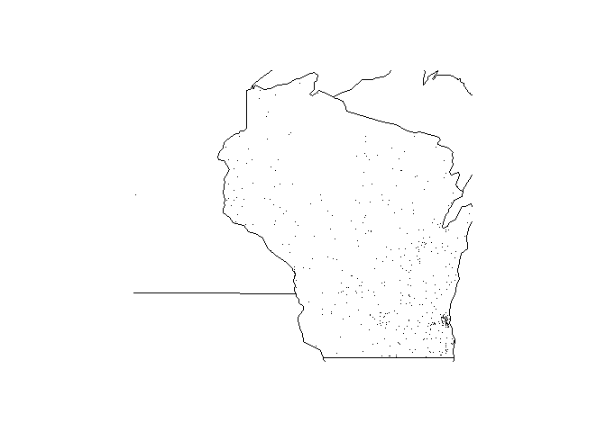

<!-- README.md is generated from README.Rmd. Please edit that file -->

# fars.functions

<!-- badges: start -->

[](https://github.com/haliyan/fars.functions/actions)
<!-- badges: end -->

The goal of fars.functions is to read in, summarize, and map FARS
(Fatality Analysis Reporting System) data on car accidents in the United
States. This package was created as part of the Coursera course
“Building R Packages” by JHU.

### VERY IMPORTANT NOTES FOR PEER REVIEWERS

**PLEASE READ (2 NOTES BELOW)**

**NOTE 1**

**This package has a R-CMD-Check badge provided by GitHub Actions and
not a Travis badge.**

Since the time of the creation of the course, Travis CI has changed
significantly. It is no longer as straightforward as outlined in the
course materials to use Travis for open-source projects. My
understanding is that using their services for open-source projects such
as this one requires signing up for a plan/trial (which in turn requires
disclosing credit card information to Travis, which I wish to avoid if
at all possible) and applying for open source credits. See Travis’s
statements on open source credits
[here](https://docs.travis-ci.com/user/billing-faq/#what-if-i-am-building-open-source)
and trial plan
[here](https://docs.travis-ci.com/user/billing-overview/#free-trial-plan).

**Due to these issues and as per the suggestion of R, I have used GitHub
Actions instead of Travis to check my package.**

You can verify that the log contains NO errors, warnings, or notes by
going to the “Actions” tab in my GitHub repo and clicking on the TOP
workflow (it should have a blue check mark beside it).

**I am asking that you please, please be considerate of this situation
when grading my work!**

**NOTE 2**

In order to pass the tests I set up in the tests sub directory, I had to
make some changes to the original `fars_read` and `fars_summarize_years`
functions.

-   Changing the `dplyr::tbl_df()` function (which has been deprecated)
    to the `tibble::as_tibble()` function in `fars.read`.

-   Adding the line
    `filename <- system.file("extdata", filename, package= "fars.functions"`
    to `fars.read`.

-   Changing `n()` to `dplyr::n()` in `fars_summarize_years`.

Omitting these changes causes problems with running examples and tests,
building the vignette, creating the README file, and passing checks.
**No other changes have been made to the original code.**

## Installation

You can install the development version of `fars.functions` in R by
entering `install_github("haliyan/fars.functions")` into the console.

*Note: Using the* `install_github` *function requires that the*
`devtools` *package be installed and loaded.* `devtools` *can be
installed using* `install.packages("devtools")` *and loaded using*
`library(devtools)`

Once the `fars.functions` package is installed, load it using
`library(fars.functions)`.

**Examples**

The fars.functions package function `make_filename` creates a FARS file
name of the correct format for a certain year supplied by the user. This
format is `accident_X.csv.bz2`, where X is the user-supplied year:

``` r
make_filename("2013")
#> [1] "accident_2013.csv.bz2"
```

The function `fars_read` reads in a FARS file of a certain file name and
creates a tibble of the data.

``` r
fars_read("accident_2013.csv.bz2")
#> # A tibble: 30,202 x 50
#>    STATE ST_CASE VE_TOTAL VE_FORMS PVH_INVL  PEDS PERNOTMVIT PERMVIT PERSONS
#>    <dbl>   <dbl>    <dbl>    <dbl>    <dbl> <dbl>      <dbl>   <dbl>   <dbl>
#>  1     1   10001        1        1        0     0          0       8       8
#>  2     1   10002        2        2        0     0          0       2       2
#>  3     1   10003        1        1        0     0          0       1       1
#>  4     1   10004        1        1        0     0          0       3       3
#>  5     1   10005        2        2        0     0          0       3       3
#>  6     1   10006        2        2        0     0          0       3       3
#>  7     1   10007        1        1        0     0          0       1       1
#>  8     1   10008        2        2        0     0          0       2       2
#>  9     1   10009        1        1        0     0          0       1       1
#> 10     1   10010        2        2        0     0          0       4       4
#> # ... with 30,192 more rows, and 41 more variables: COUNTY <dbl>, CITY <dbl>,
#> #   DAY <dbl>, MONTH <dbl>, YEAR <dbl>, DAY_WEEK <dbl>, HOUR <dbl>,
#> #   MINUTE <dbl>, NHS <dbl>, ROAD_FNC <dbl>, ROUTE <dbl>, TWAY_ID <chr>,
#> #   TWAY_ID2 <chr>, MILEPT <dbl>, LATITUDE <dbl>, LONGITUD <dbl>, SP_JUR <dbl>,
#> #   HARM_EV <dbl>, MAN_COLL <dbl>, RELJCT1 <dbl>, RELJCT2 <dbl>, TYP_INT <dbl>,
#> #   WRK_ZONE <dbl>, REL_ROAD <dbl>, LGT_COND <dbl>, WEATHER1 <dbl>,
#> #   WEATHER2 <dbl>, WEATHER <dbl>, SCH_BUS <dbl>, RAIL <chr>, NOT_HOUR <dbl>,
#> #   NOT_MIN <dbl>, ARR_HOUR <dbl>, ARR_MIN <dbl>, HOSP_HR <dbl>, HOSP_MN <dbl>,
#> #   CF1 <dbl>, CF2 <dbl>, CF3 <dbl>, FATALS <dbl>, DRUNK_DR <dbl>
```

This function can also be used together with `make_filename` and the
pipe operator `%>%` from the `magrittr` package, especially if the
correct file name format is not known.

``` r
library(magrittr)
make_filename("2013") %>% 
  fars_read()
#> # A tibble: 30,202 x 50
#>    STATE ST_CASE VE_TOTAL VE_FORMS PVH_INVL  PEDS PERNOTMVIT PERMVIT PERSONS
#>    <dbl>   <dbl>    <dbl>    <dbl>    <dbl> <dbl>      <dbl>   <dbl>   <dbl>
#>  1     1   10001        1        1        0     0          0       8       8
#>  2     1   10002        2        2        0     0          0       2       2
#>  3     1   10003        1        1        0     0          0       1       1
#>  4     1   10004        1        1        0     0          0       3       3
#>  5     1   10005        2        2        0     0          0       3       3
#>  6     1   10006        2        2        0     0          0       3       3
#>  7     1   10007        1        1        0     0          0       1       1
#>  8     1   10008        2        2        0     0          0       2       2
#>  9     1   10009        1        1        0     0          0       1       1
#> 10     1   10010        2        2        0     0          0       4       4
#> # ... with 30,192 more rows, and 41 more variables: COUNTY <dbl>, CITY <dbl>,
#> #   DAY <dbl>, MONTH <dbl>, YEAR <dbl>, DAY_WEEK <dbl>, HOUR <dbl>,
#> #   MINUTE <dbl>, NHS <dbl>, ROAD_FNC <dbl>, ROUTE <dbl>, TWAY_ID <chr>,
#> #   TWAY_ID2 <chr>, MILEPT <dbl>, LATITUDE <dbl>, LONGITUD <dbl>, SP_JUR <dbl>,
#> #   HARM_EV <dbl>, MAN_COLL <dbl>, RELJCT1 <dbl>, RELJCT2 <dbl>, TYP_INT <dbl>,
#> #   WRK_ZONE <dbl>, REL_ROAD <dbl>, LGT_COND <dbl>, WEATHER1 <dbl>,
#> #   WEATHER2 <dbl>, WEATHER <dbl>, SCH_BUS <dbl>, RAIL <chr>, NOT_HOUR <dbl>,
#> #   NOT_MIN <dbl>, ARR_HOUR <dbl>, ARR_MIN <dbl>, HOSP_HR <dbl>, HOSP_MN <dbl>,
#> #   CF1 <dbl>, CF2 <dbl>, CF3 <dbl>, FATALS <dbl>, DRUNK_DR <dbl>
```

The `fars_read_years` takes a list or vector of years and produces a
list of tibbles. Each tibble contains the months in one of the years in
the supplied vector of years. The number of rows for each month
represents the number of accidents that occurred in that month.

``` r
fars_read_years(c("2013","2014"))
#> [[1]]
#> # A tibble: 30,202 x 2
#>    MONTH year 
#>    <dbl> <chr>
#>  1     1 2013 
#>  2     1 2013 
#>  3     1 2013 
#>  4     1 2013 
#>  5     1 2013 
#>  6     1 2013 
#>  7     1 2013 
#>  8     1 2013 
#>  9     1 2013 
#> 10     1 2013 
#> # ... with 30,192 more rows
#> 
#> [[2]]
#> # A tibble: 30,056 x 2
#>    MONTH year 
#>    <dbl> <chr>
#>  1     1 2014 
#>  2     1 2014 
#>  3     1 2014 
#>  4     1 2014 
#>  5     1 2014 
#>  6     1 2014 
#>  7     1 2014 
#>  8     1 2014 
#>  9     1 2014 
#> 10     1 2014 
#> # ... with 30,046 more rows
```

The `fars_summarize_years` function also takes a list or vector of years
and produces a single tibble. The rows of the tibble represent the 12
months in a year. The columns of the tibble are the years that were
supplied to the function. The values contained in the tibble are the
numbers of accidents in a particular month of a particular year.

``` r
fars_summarize_years(c("2013","2014"))
#> # A tibble: 12 x 3
#>    MONTH `2013` `2014`
#>    <dbl>  <int>  <int>
#>  1     1   2230   2168
#>  2     2   1952   1893
#>  3     3   2356   2245
#>  4     4   2300   2308
#>  5     5   2532   2596
#>  6     6   2692   2583
#>  7     7   2660   2696
#>  8     8   2899   2800
#>  9     9   2741   2618
#> 10    10   2768   2831
#> 11    11   2615   2714
#> 12    12   2457   2604
```

The `fars_map_state` function creates a map of accidents in a given
state in a given year. For example, the following code creates a map of
the accidents in the state of Wisconsin in 2014:

``` r
fars_map_state(55, 2014) 
```



*Note: for some state numbers, the* `fars_map_state` *function will not
work, for various reasons. A quick summary table of these is included
below. For more details plus a full table of all 56 state numbers and
corresponding state names, please see the package vignette. You can
instruct R to build the vignette when installing from GitHub by
specifying* `build_vignettes=TRUE` *when installing with*
`install.github()`.

| Numbers | Reasons                 |
|--------:|:------------------------|
|       2 | Alaska; out of bounds   |
|       3 | American Samoa; no data |
|       7 | Canal Zone; no data     |
|      14 | Guam; no data           |
|      15 | Hawaii; out of bounds   |
|      43 | Puerto Rico; no data    |
|      52 | Virgin Islands; no data |

**License**

GPL
